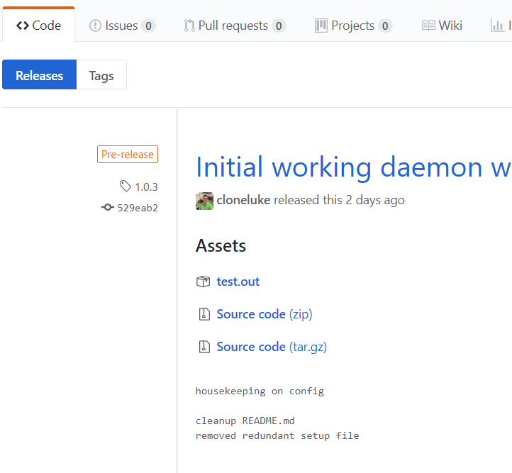

# github-cookbook

A Library Cookbook for interacting with the Github API

## Supported Platforms

* Ubuntu

## github_asset Resource/Provider

Downloads an asset from a Github release

### Actions

- **download** - downloads the asset from the Github releaseto disk. (default)

### Parameter Attributes

- **name** - name of the asset to download (name attribute) - if wanting the github default asset tarball, use the name 'tarball'
- **release** - name of the release the asset is a part of
- **repo** - repository the release is a part of (required for private repositories)
- **github_token** - Github token to perform the download with (required for private repositories)
- **owner** - owner of the downloaded asset on disk
- **group** - group of the downloaded asset on disk
- **force** - force downloading even if the asset already exists on disk

### Example Resource Call

```ruby
github_asset 'tarball' do
  action [:download]
  repo 'org/repo'
  release '1.0.3'
  github_token 'abc123'
end
```

### Github Release Assets



In the above screen, you can see how custom uploaded assets apear (test.out) versus github's default assets (zip and tar.gz)

## HTTP proxy support

Ensure the `HTTPS_PROXY` environment variable is set for the shell executing `chef-client` or `chef-solo`. The value should be a fully qualified URL containing the host, port, username, and password for your proxy.

# Author

Author:: Jamie Winsor (<jamie@vialstudios.com>)
